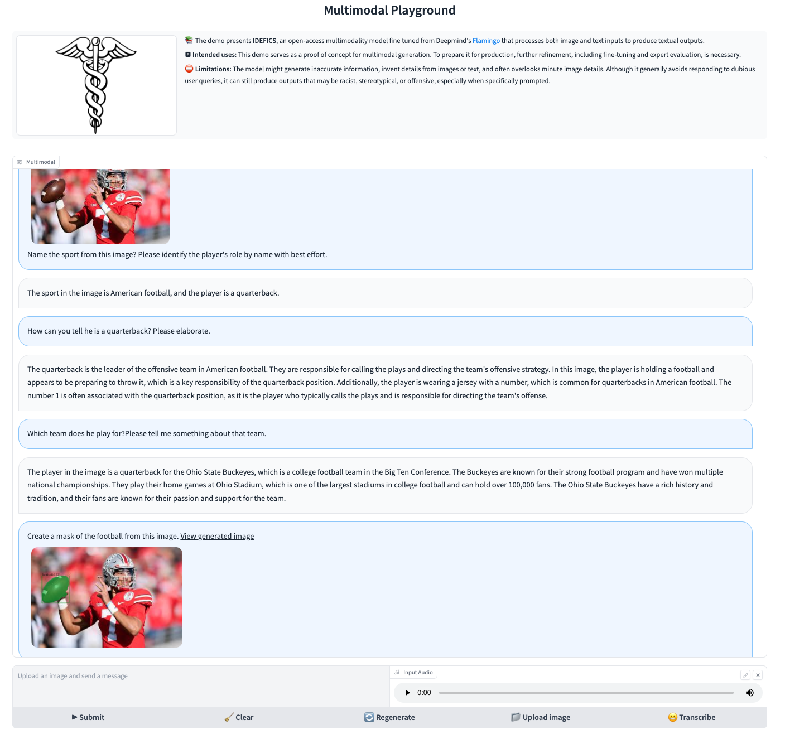

# Dialogue Guided Visual Langauge Processing

[Blog Post]() [Demo](https://radaide.cavatar.info:7863)

Welsome to the open source implementation of DGVLP, a multimodal visual language learning  that encompasses language intelligence, vision understanding and processing. 



# Installation
To install the packages in an existing environment, run 
```
pip install -r requirements.txt
```

# Usage

```
python app_radaide.py
```

# Configuration Options

## Firewall

Allow ports 7863 and 8080 on server node an port 8080-8083 from TGI inference nodes.

## Enable SSL cert and pem

Generate your TLS/SSL certificate and signed by a publicly trusted certificate authority (CA). You can elect to self-sign a temporary certificate pair.


## File server
Python's http.server extended to include a file upload page.
```
python -m uploadserver 8080 --bind 0.0.0.0 --directory "/tmp/gradio"
```

**How to Contribute**
---

1. Clone repo and create a new branch: `$ git checkout https://github.com/alichtman/stronghold -b name_for_new_branch`.
2. Make changes and test
3. Submit Pull Request with comprehensive description of changes


**Acknowledgements**
---

+ [HuggingFaceM4](https://huggingface.co/HuggingFaceM4) for IDEFICS.
+ [Meta Resrach](https://huggingface.co/meta-llama) for the pre-trained Llama-v2.
+ [IDEA-Research](https://github.com/IDEA-Research/Grounded-Segment-Anything) for the Grounded SAM.
+ [LangChain](https://www.langchain.com/) for LLM task orchastration.
+ [Hugging Face](https://huggingface.co/distilbert-base-uncased-finetuned-sst-2-english) for pre-trained LM for multi-class text classification.
